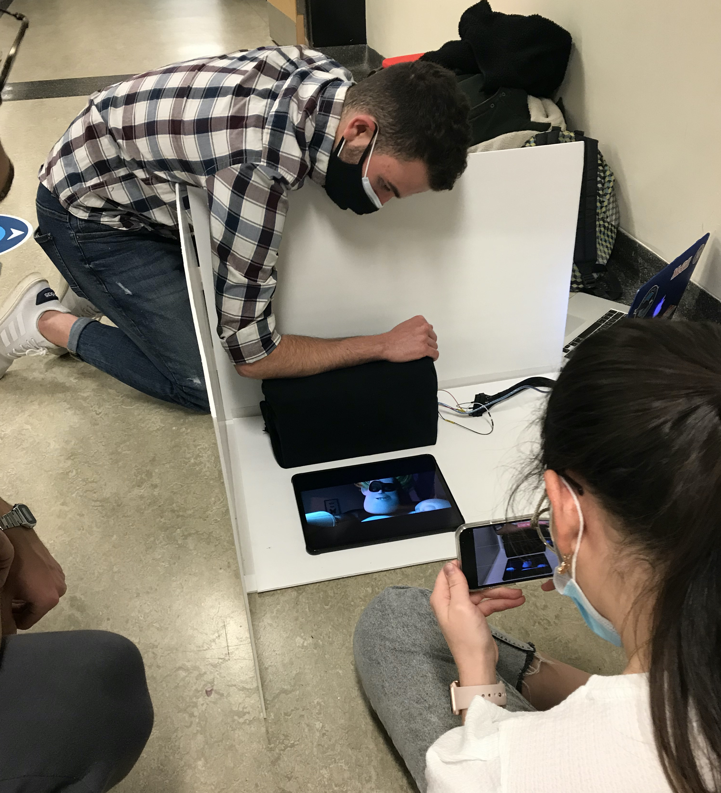
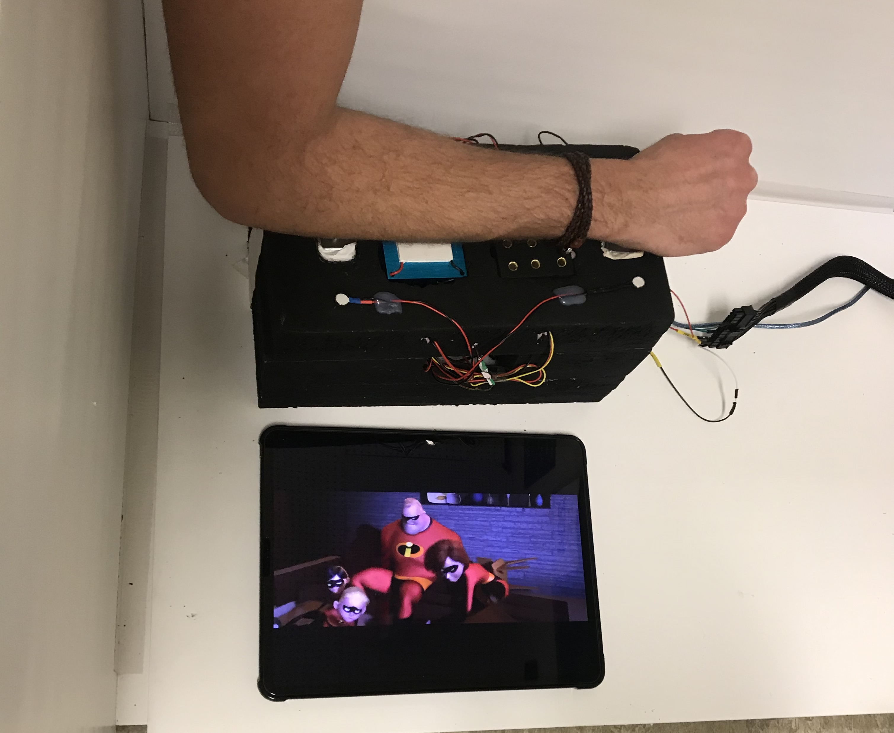
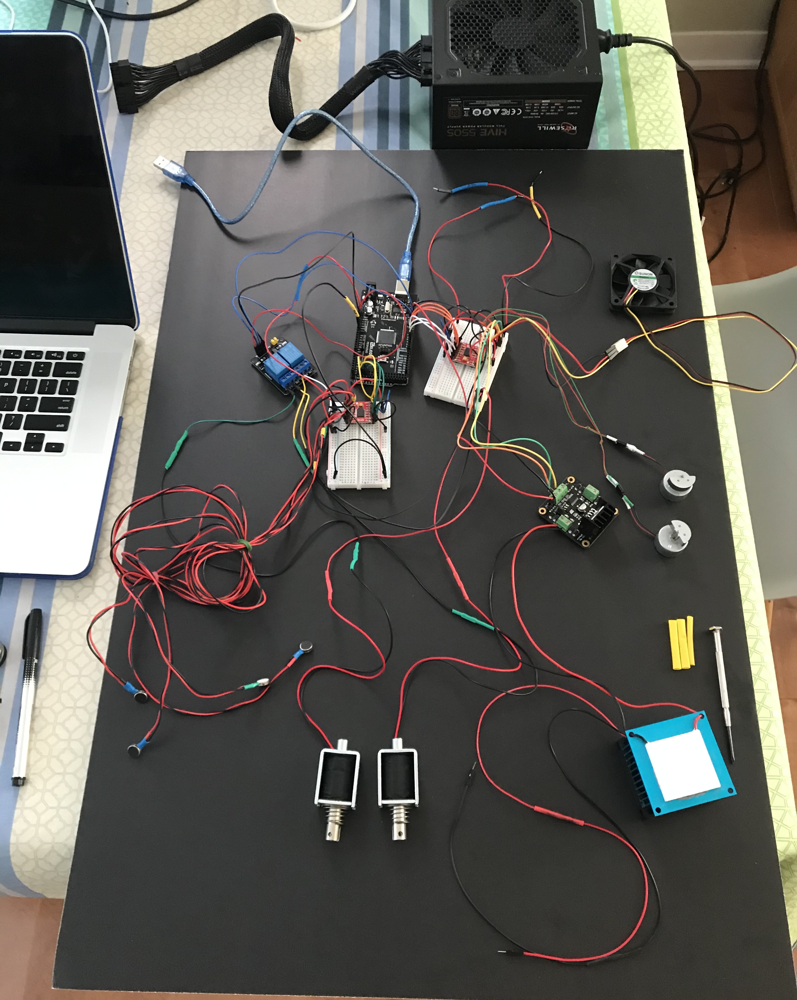
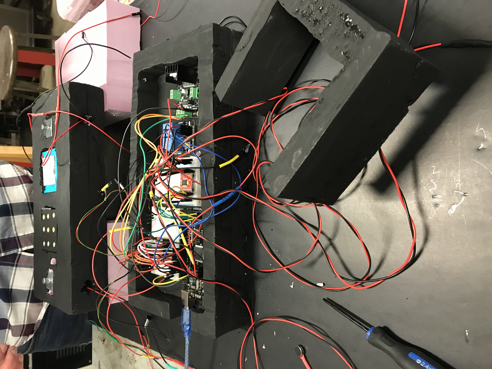

# Multimodal Haptic Armrest for Immersive 4D Experiences

**NOTE:** a *Work-in-Progress Paper* concerning this project has been submitted to the IEEE **World Haptics** Conference 2021 (July 6-9, 2021, virtual, previously in Montreal, Canada). Link to the paper [here](https://documentcloud.adobe.com/link/review?uri=urn:aaid:scds:US:3ce078ac-f1d8-45d8-a8a3-f05573ea982f).

## Project Description 📺
The 4D cinema experience has been growing steadily for the past decade.
However, especially during the Covid-19 pandemic, content viewing is shifting increasingly towards at-home consumption, propelled by streaming services such as Netflix, Amazon Prime Video and Disney+.
While a massive amount of content is already available on these platforms, and the 4D experience in movie theatres is well established, the home theatre equivalent has yet to gain significant popularity, in part due to the high cost of the associated systems.
To address this barrier to adoption, we investigate the feasibility of augmenting the armrests of regular chairs with haptic effects that can offer some portion of the experience available to cinema-goers.
As a starting point, our aim was to develop a reasonably small, robust, and low-cost armrest device capable of providing a diverse range of haptic feedback effects.

## Development
The development of the prototype was done as part of the McGill University Mechanical Engineering Capstone program (MECH 463D1/D2), over the Fall 2020 and Winter 2021 semesters. The project is affiliated to the *[Shared Reality Lab](http://srl.mcgill.ca/)* and its development started from the preliminary **Conceptual Design** phase all the way to the **Final Assembly** of the prototype, which was presented on *[Design Day](https://www.mcgill.ca/engineering/students/undergraduate/mcgill-design-day-2021).*

### Final Product
<!-- 
 -->
Side View     |  Top View    |  Top View with cloth      |
:---------------------:|:---------------------:|:---------------------:
  |    |  

### Prototype Testing
Synchronization test     | Forearm sensation test    |  Final picture      |
:---------------------:|:---------------------:|:---------------------:
  |    |  

### Prototype Assembly
Actuator tests     | Assembly phase 1    
:---------------------:|:---------------------:|
  |    

## Links
[Prototype Development video](https://youtu.be/AspdwDC-C9g)  
[Prototype Demonstration video](https://youtu.be/Ie1n5zDHzoA)  
[Work-in-Progress Paper](https://documentcloud.adobe.com/link/review?uri=urn:aaid:scds:US:3ce078ac-f1d8-45d8-a8a3-f05573ea982f)
